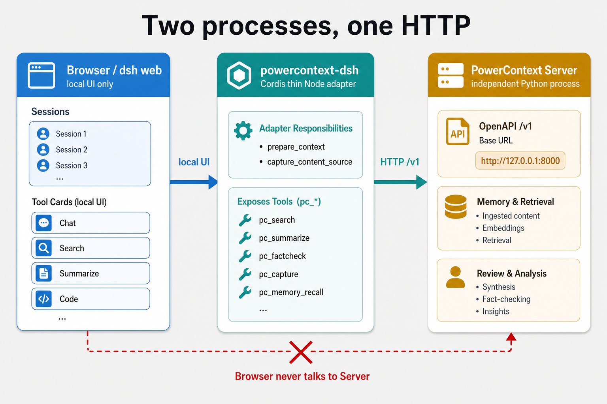
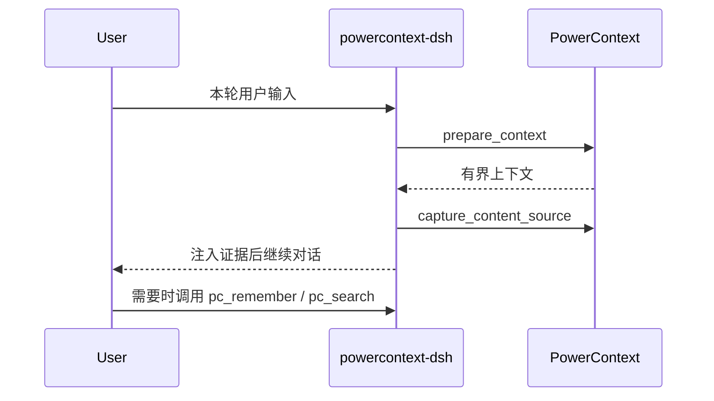
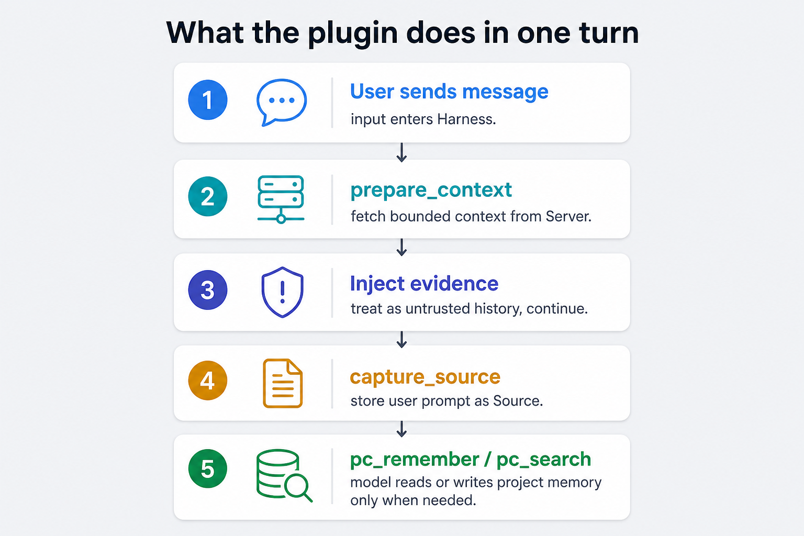

# 给 DeepSeek Harness 写个 PowerContext 插件

就在昨天晚上（2026 年 8 月 13 日）DeepSeek 开源了自己的 Harness 框架： [deepseek-ai/deepseek-harness](https://github.com/deepseek-ai/deepseek-harness)，协议 MIT，当前是 **developer preview**。当晚我就把 [DeepSeek Harness](https://github.com/deepseek-ai/deepseek-harness) （以下都统称 dsh）跑起来了。

翻看了一下官方的相关资料，我发现 DeepSeek 这套 Harness 最有意思的一点就是内核的 [Cordis](https://github.com/cordiverse/cordis) 机制：**everything is a plugin**。

那可玩性就很高了。

这两天 OceanBase 全新升级的 PowerContext 版本也正式发布，这不巧了吗，择日不住撞日，我即刻动手写了 PowerContext 的 dsh 插件。

## 一、关于 DeepSeek Harness

官方给的最短启动方式：

```bash
npx @deepseek-ai/dsh web
```

这条命令会拉起 Web UI。默认地址是 `http://127.0.0.1:3080`。

从源码跑也行：

```bash
git clone https://github.com/deepseek-ai/deepseek-harness.git
cd deepseek-harness
pnpm install
pnpm run build
pnpm dsh web
```

方式非常简单，启动后的页面：


启动 dsh 并不是难事，但是有意思的地方我觉得在于 dsh 的 **Cordis** 机制。

现在的 Agent 产品大多数的做法都是把模型的适配、bash、权限、循环等等全定制化嵌入在主程序里，如果要加一块能力就得去改它的仓库和源码。

而 cordis 机制简单说，就是把这件事反过来了：模型适配的是插件，插件在 dsh 中是一等公民。工具是插件，会话是插件，UI 也是插件。当要加入一个功能时，选、换、扩，改的都是配置，不是 Harness 源码。


DeepSeek 官方页是这么写的：Harness 建在 Cordis 的插件系统上，插件提供模型、工具、skill、会话、沙箱、存储、循环、调度和 UI。Cordis 的服务和事件让它们协作。开发者可以在配置里挑选、替换、扩展任何能力，而不改 DeepSeek Harness 源码。

关于 Cordis 机制 DeepSeek 还出了相应的论文： [_A Programming Paradigm for Spatiotemporal Composability_](https://github.com/cordiverse/paper)。

概念上先说到这里。组合包、profile、怎么装进运行时，这些工程细节放到第三节，对照 powercontext-dsh 一起看会更清楚。

---

## 二、关于 PowerContext

PowerContext 这个项目其实是 PowerMem 的全面升级（PowerMem 2.0），不再局限于给 Agent 提供 Memory，而是升级为可以把 Memory、Experience、Skill 和 Handoff 做成**项目级、跨会话**复用的 Agent 上下文，后面的会话要能找回前面的决策、结果、当前状态、下一步，而不必把整段聊天史塞回窗口。PowerContext 带了本地 Server、SQLite、异步 Python Client、Core SDK、CLI，以及 Codex 插件，配套能力也非常齐全。

顺带一提，LOCOMO 测试中全量 1,540 题、10 段对话上，PowerContext 的数字是：准确率 **90.78%**（1,398/1,540），检索 p95 **1.38 s**，每题回答约 **1.65 k** tokens。对照 Full-context baseline 是 52.9%、17.12 s、26 k tokens。而原先的 PowerMem 一版是 87.79%、1.44 s、约 0.9 k tokens。

默认把 PowerContext Server 拉起来是这样：

```bash
uv tool install "powercontext[cli,server] @ git+https://github.com/oceanbase/powercontext.git@master"
powercontext server run
```

> Server 默认听 `http://127.0.0.1:8000`。插件稍后连的就是这个地址。

监听 `http://127.0.0.1:8000`，无认证，数据落在用户目录的 SQLite，可用 `POWERCONTEXT_HOME` 覆盖。

那么问题来了：PowerContext 已经有独立 Server，dsh 这边又是 Cordis 插件树。要把 PowerContext 的能力嵌进 dsh，该怎么做？

答案是写一层 **薄适配插件**。一边挂进 Cordis，一边用 HTTP 调 PowerContext。这就是 [powercontext-dsh](https://github.com/knqiufan/powercontext-dsh)。

### 2.1 两进程架构：插件站在中间

整条链路其实就三截，跑起来是两个进程：

1. **浏览器 / dsh Web**：只负责本机 UI，会话、工具卡片都在这里。
2. **powercontext-dsh**：跑在 Harness 进程里的 Cordis 薄适配。负责钩子（`prepare_context`、`capture_content_source`），并把能力暴露成 `pc_*` 工具。
3. **PowerContext Server**：独立的 Python 进程，听 `http://127.0.0.1:8000`，管记忆、检索、审核和分析等。

浏览器从不直连 Server，UI 只跟本机 Harness 说话，插件再去 HTTP 调 `/v1`。



插件不重写存储，不嵌 Python，只做 Cordis 这一侧的适配。Server 有的能力，通过 HTTP Client、自动钩子、具名工具和 `/pc` 命令四层露出来。

下面具体来看 powercontext-dsh 是怎么写的。

---

## 三、powercontext-dsh 是怎么写的

动手写之前，先看看官方教程是怎么说的。把组合包、profile、安装方式这几个概念摸清楚，再落到 powercontext-dsh 是怎么生长出来的。

### 3.1 先搞清概念：组合包和 profile

官方教程里反复出现两个词：**组合包（bundle）** 和 **profile**。简单说，一个是「你做出来的插件包」，一个是「用户实际启动的那套配置」。

**组合包**就是一个普通的 npm 包，只不过多声明了一句「我是 dsh 的一层」。`package.json` 里写上 `dsh.bundle`，再附一份 `cordis.patch.yml`。这份 yaml 告诉 Harness：把我插进插件树的哪一行、默认配置是什么。你写好、发布出去的，就是组合包。powercontext-dsh 本质上也是这样一个包。

**profile** 则是用户这边的启动配方，放在 `$DSH_HOME/profiles/<name>`。它不负责写业务逻辑，只回答一件事：这次启动要叠哪些组合包、按什么顺序叠。当在命令行中敲出 `dsh web` 或 `dsh --profile web`，真正起来的就是某个 profile。

**组合包像乐高积木，profile 像说明书上的拼法。**积木可以到处分发；说明书决定你今天拼成 Web UI 还是别的形态。两者角色不同，没有东西同时是两者。

还有一点很关键：`dsh plugin --profile web add <包>` 并不是把代码塞进 Harness 仓库。它在 profile 目录里转发给 pnpm。装成功后，若该包声明了 `dsh.bundle`，包名就会进 `dsh.profile.bundles`。下次启动按层叠加各包的 `cordis.patch.yml`。

也就是说，插件不是挂件，它是运行时的组成单位。卸掉一层，对应的工具、命令、钩子一起走。这是 Cordis 的可逆 effect：卸载时登记要收回。

概念有了，下面按官方最小例子走一遍，再对照 powercontext-dsh 看它是怎么落地的。

### 3.2 最小组合包：三个文件挂上一层

官方最小例子，三个文件就够。`package.json` 声明自己是组合包，入口指向已构建的 JS：

```json
{
  "name": "dsh-hello-plugin",
  "version": "0.1.0",
  "type": "module",
  "main": "index.js",
  "files": ["index.js", "cordis.patch.yml"],
  "dsh": { "bundle": { "patch": "./cordis.patch.yml" } }
}
```

> `dsh.bundle.patch` 指向那份会插入配置树的 yaml，没有这一段，包只是普通依赖。

函数插件只做 named export。`name`、`inject`、`Config`、`apply`。

```js
export const name = 'hello-plugin'

export function apply() {
  console.log('[hello-plugin] plugin loaded!')
}
```

> 只导出 `name` 和 `apply` 也能加载。进生产组合时再补 `inject` 和 `Config`。

`cordis.patch.yml` 往配置树里插一行。`name` 是 Node 模块名，要能解析到上面的 `main`：

```yaml
- insert:
    - id: hello
      name: dsh-hello-plugin
```

你写的是插件入口；dsh 这边怎么接到它，链路其实很短。

启动某个 profile 时，Loader 会叠各组合包的 `cordis.patch.yml`。patch 里那一行 `name: dsh-hello-plugin`，就是告诉运行时：**按这个包名去 `import` 模块**。拿到模块后，Loader 会做一次规范化（`unwrapExports`），再交给 Cordis 注册并调用 `apply`：

```ts
// vendor/loader：加载一层插件时的核心路径（示意）
plugin = this.loader.unwrapExports(
  await this.parent.tree.import(this.options.name)  // 这里的 name 就是 patch 里的包名
)
fiber = this.ctx.registry.plugin(plugin, this.options.config)  // 注册并执行 apply
```

所以：`package.json` 声明 bundle → patch 插入一行 → Loader `import` 包名 → 调你的 `apply`。中间没有另一套「插件 RPC」；Cordis 认的就是这份命名导出。这也是为什么 **不要**再写 `export default`：`unwrapExports` 一旦看到 default，会把整个命名空间折掉，`inject` 也就丢了。

powercontext-dsh 也是同一套骨架，只是 `apply` 更长、patch 里多了默认连本机 Server 的配置。

### 3.3 进生产组合还要守的规则

再往上，写一个能进生产组合的插件，还要守这几条。来自 dsh 的 `packages/AGENTS.md` 和官方配置教程：

| 规则 | 含义 |
|---|---|
| 函数插件 named export | `name` / `inject` / `Config` / `apply`，禁止 default export |
| `inject` 只写硬依赖 | 可选服务用 `ctx.get(name)`，不要用 `ctx.xxx` 去碰没声明的服务 |
| `Config` 需要是 Standard Schema | 普通对象不算，Cordis 要用它填默认值和做校验 |
| 工具走 `defineTool` | 参数校验、输出 schema、`execute` 返回规范 JSON，不要让模型从散文里抠 id |
| 树外插件交 `lib/` | profile 里的 TS 不会被 Harness 编译 |
| 提供 `./invariant` | 树外包可以是空 installer |

`inject` 写多了，没装对应服务时整行挂不上。写少了，该用的能力拿不到。powercontext-dsh 的选择是：硬依赖 `tools` 和 `agents`，命令、skill、系统提示词用 `ctx.get`，没有就不注册，不崩。

### 3.4 入口、patch：规则在真实插件里长什么样

如下。`apply` 里动态加载 Harness 的 peer，避免树外包静态 `import '@deepseek-ai/*'` 时解析不到：

```ts
export const name = 'powercontext-dsh'
export const inject = ['tools', 'agents']

export async function apply(ctx: Context, config: Config): Promise<void> {
  const toolsMod = await loadPeer<{ defineTool: DefineTool }>('@deepseek-ai/dsh-tools')
  const llmMod = await loadPeer<{ createUserMessage: CreateUserMessage }>('@deepseek-ai/dsh-llm')
  const runtime = createRuntime(ctx, config)
  registerGuidance(ctx)
  registerTools(ctx, runtime, toolsMod.defineTool)
  registerRecall(ctx, runtime, llmMod.createUserMessage)
  registerCommands(ctx, runtime)
  registerSkill(ctx)
}
```

> 核心逻辑就这几步：拿 peer、建 runtime、注册引导词、工具、召回、命令和 skill。

本包的 patch 插入一行，默认连本机 Server：

```yaml
- insert:
    - id: powercontext-dsh
      name: powercontext-dsh
      config:
        baseUrl: http://127.0.0.1:8000
        timeoutMs: 4000
        requestTimeoutMs: 1000
        maxBytes: 8000
        capturePrompts: true
        flushOnCapture: false
```

> 密钥不要写进这份 patch。`--dump-config` 会把它整份打出来。

实际上骨架就是 hello 插件放大一号，根据规则表来做：named export 齐了，`inject` 只锁硬依赖，配置走 patch，交出去的是构建后的 `lib/`。

### 3.5 四层暴露：Server 有的，插件里都能用

目标不是把 48 个 OpenAPI 操作都注册成模型工具，工具表会被淹没，如下四层加在一起，才等于「Server 有的，插件里都能用」。

| 层 | 谁调用 | 覆盖 |
|---|---|---|
| A. HTTP Client | 插件内部 | 48/48，无例外 |
| B. 自动钩子 | `agent/pre-step` | `prepare_context` + `capture_content_source` |
| C. 具名 `pc_*` 工具 | 模型 | Memory / Handoff / Source / 经验与技能的常用路径 |
| D. `/pc` 命令 + `pc_call` | 人和模型 | 其余全部 `operationId`，含审核 |

当前包版本是 `0.0.2`。具名工具按能力拆开：

| 能力 | 工具 | HTTP |
|---|---|---|
| 记忆 | `pc_search` `pc_remember` `pc_memory_list` `pc_memory_get` `pc_memory_revise` `pc_memory_retire` | `/v1/memory/*` |
| 上下文 | `pc_prepare_context` `pc_capture_source` | `/v1/context/prepare`、`/v1/sources/content` |
| 交接 | `pc_handoff_activate` `pc_handoff_prepare` `pc_handoff_finalize` `pc_handoff_commit` `pc_handoff_continue` | `/v1/handoff/*` |
| 经验 / 技能 | `pc_experience_generate` `pc_experience_get` `pc_skill_generate` `pc_skill_get` | `/v1/experience/*`、`/v1/skill/*` |
| 审核 | `pc_review_list` `pc_review_get` | `/v1/artifact-candidates/*` |
| 其余 | `pc_call` | 全部 `operationId` |

操作表从本包 vendored 的 `openapi/powercontext.yaml` 生成，不读 PowerContext 的 Python 源码。运行时只 `fetch`。

### 3.6 钩子：每轮开口前先召回、再存档

再四层里 C、D 是模型和人主动去调用的，真正让「跨会话记忆」显得自动的是中间那一层 **自动钩子**。不用记口令，插件会在每轮对话开始前自己跑两步。下面展开说这两步在干什么。

用户每发一条消息、模型还没开始答的时候，钩子会自动干两件事：

1. **先召回**：调 `prepare_context`，向 Server 要一小段跟当前项目相关的历史上下文，塞进本轮对话。注意这是「参考材料」，不是绝对真理，模型仍要自己判断。
2. **再存档**：调 `capture_content_source`，把用户刚说的原话原样存进 Server，当成一条 Source（原始证据）。这时还不抽取记忆，只是先把话说下来，以后才能检索、抽取。

这两步彼此独立。Server 挂了、超时、存档失败，都走 **fail-open**：跳过召回，工具侧返回 `{ ok: false, code: "unavailable" }`，聊天照常继续，不会因为记忆服务挂了就把这一轮弄黄。

项目隔离靠的是 **scope**。它跟的是你在 dsh 里打开的那个工作区的 git remote，不是你敲 `dsh web` 时所在的目录。所以：同一个仓库开两个会话，能互相召回；换一个仓库，搜不到是隔离生效，而不是插件坏了。





写到这里，插件该有的骨架、规则、暴露面和运行时钩子都齐了。剩下就是把它装进 dsh，和 Server 一起跑起来。

---

## 四、把 powercontext-dsh 装进 dsh

PowerContext Server 和 DeepSeek Harness 是两个进程。缺一不可。

### 4.1 先把 Server 拉起来

```bash
uv tool install "powercontext[cli,server] @ git+https://github.com/oceanbase/powercontext.git@master"
powercontext server run
```

本地已有 PowerContext 源码时，用 `uv run powercontext server run`。默认 `http://127.0.0.1:8000`，无认证。

可以另开终端看一眼是否已经成功启动：

```bash
curl http://127.0.0.1:8000/health/live
curl http://127.0.0.1:8000/health/ready
```

`live` 要成功。`ready` 在没配推理模型时可以是 `degraded`，显式记忆写入不依赖抽取作业。

### 4.2 再装插件

先让 web profile 存在，执行一次 `dsh web` 即可，然后可以关掉。

powercontext-dsh 推荐装 GitHub Release 的 tarball。当前文档示例是 `powercontext-dsh-0.0.2.tgz`：

```bash
dsh plugin --profile web add ./powercontext-dsh-0.0.2.tgz
```

Release 的下载 URL 同样可用。


使用源码也是可以直接安装的。`lib/` 已提交进仓库，clone 后不必先 build：

```bash
git clone https://github.com/knqiufan/powercontext-dsh.git
cd powercontext-dsh
dsh plugin --profile web add .
```

也可以写成绝对路径，例如 `dsh plugin --profile web add /path/to/powercontext-dsh`。

改了 TypeScript 才需要 `pnpm install`、`pnpm test`、`pnpm build`，然后重启 `dsh web`。

等之后 powercontext-dsh 发布到 npm 之后还可以：

```bash
dsh plugin --profile web add powercontext-dsh
```

当然也可以选择加上`--dump-config` 命令，先只打印查看组合后的配置树，查看 powercontext-dsh 是否已经正确安装：

```bash
dsh --profile web --dump-config
```

输出里应有 `id: powercontext-dsh`，说明已经安装插件成功了，即可以输入以下命令开始使用：

```bash
dsh web
```

装载上插件之后，可以在 dsh Web UI 界面上看到，插件列表里搜 `powercontext`，条目名是 `powercontext-dsh`。：


输入 `/pc` 命令显示的进行 PowerContext Server 的使用，并在 dsh 会话和其轨迹中都可以看到，已经成功使用了：


至此 powercontext-dsh 插件就已经成功安装上，可以在 dsh 上正常使用了。插件会在后台自动召回、保存用户输入。需要读写记忆、交接任务或生成经验 / 技能时，模型调用对应的 `pc_*`。对话里可以打 `/pc doctor` 看 Server 是否可达。

最后提一嘴，如果想要卸载插件的话也很简单：

```bash
dsh plugin --profile web remove powercontext-dsh
```

### 4.4 远程 Server 和配置

插件跑在 Harness 进程里，浏览器不直连 PowerContext，所以没有前端 CORS 问题。要通的是：跑 `dsh web` 的那台机器到 Server URL。

默认 PowerContext Server 只绑 `127.0.0.1`，如果要配置远程服务器访问 Server，可以在环境变量上配置地址和对应 Authorization ：

```bash
export POWERCONTEXT_DSH_BASE_URL=https://pc.example.com
export POWERCONTEXT_DSH_AUTHORIZATION="Bearer <long-random-secret>"
dsh web
```

> 环境变量优先于 patch。密钥不要写进 `--dump-config` 能打印的文件。

`POWERCONTEXT_DSH_AUTHORIZATION` 要写成完整的 `Bearer <token>`，与 `POWERCONTEXT_SERVER_AUTH_TOKEN` 对应。

长期非密钥默认可以写在 `~/.dsh/profiles/web/cordis.patch.yml`。Harness 会整份替换该行 `config`，要保留的项一起写上：

```yaml
- id: powercontext-dsh
  config:
    baseUrl: https://pc.example.com
    timeoutMs: 4000
    requestTimeoutMs: 1000
    maxBytes: 8000
    capturePrompts: true
    flushOnCapture: false
```

| 字段 | 环境变量 | 默认 | 含义 |
|---|---|---|---|
| `baseUrl` | `POWERCONTEXT_DSH_BASE_URL` | `http://127.0.0.1:8000` | Server 根 URL，无尾斜杠 |
| `authorization` | `POWERCONTEXT_DSH_AUTHORIZATION` | 空 | 完整 `Bearer <token>` |
| `scopeId` | `POWERCONTEXT_DSH_SCOPE_ID` | 空 | 覆盖自动推导的项目 scope |
| `timeoutMs` |  | `4000` | 召回 + 捕获的共享预算 |
| `requestTimeoutMs` |  | `1000` | 单次 HTTP 超时 |
| `maxBytes` |  | `8000` | `prepare_context` 预算 |
| `capturePrompts` | `POWERCONTEXT_DSH_CAPTURE_PROMPTS` | `true` | 把用户输入存成 Source |
| `flushOnCapture` | `POWERCONTEXT_DSH_FLUSH_ON_CAPTURE` | `false` | 捕获后立刻 flush |

设置页的「插件配置」只有终端、Agent 循环、网页搜索三张卡片。本包不会出现在那里。这是 Harness 的产品切分，不是安装失败。

---

## 五、总结

回头看这条链路，其实就三截。

- **DeepSeek Harness** 把 Agent 运行时拆成可组合的插件树，内核是 Cordis。
- **PowerContext** 把项目记忆、召回、交接放在独立 Server 里，HTTP 是唯一契约。
- **powercontext-dsh** 不重写存储，不嵌 Python，只做 Cordis 这一侧的薄适配。

对我来说，Cordis 真正灵活的地方不是能加点工具，而是可以把记忆、权限、评测、甚至另一套 UI，都做成可装卸的一层，装上就进组合，卸下就从工具表和钩子里消失。配置树能 dump，层来自哪个包也说得清。

可以展开的想象还很多。比如把内部知识库做成 bundle，把公司的审批流挂成命令，而不是让模型静默批准；把评测机写成 headless profile 上的一层，和 Web 共用同一套 Client。这些都不需要 fork Harness。

当然，developer preview 还在快速迭代。树外插件要自己产出 `lib/`，peer 要从 Harness 安装里解析。这些是代价，换来的是：记忆系统可以和编码 Agent 分开演进。

---

## 写在最后

Agent 越来越会写代码。真正卡住日常的，常常是昨天定过的约定，今天新会话里找不回来。

Harness 解决模型怎么在环境里动手，PowerContext 解决项目上下文怎么跨会话还在，dsh 的 Cordis 机制让这两件事能扣在一起，而不必变成一个巨石仓库。

还得是 DeepSeek 啊。

---

## 开源地址

1. [PowerContext](https://github.com/oceanbase/powercontext)
2. [DeepSeek Harness](https://github.com/deepseek-ai/deepseek-harness)
3. [powercontext-dsh](https://github.com/knqiufan/powercontext-dsh)

相关：

4. [Cordis](https://github.com/cordiverse/cordis)
5. [A Programming Paradigm for Spatiotemporal Composability](https://github.com/cordiverse/paper)
6. [DeepSeek Harness 官方介绍](https://deepseek.com/harness/en/)

